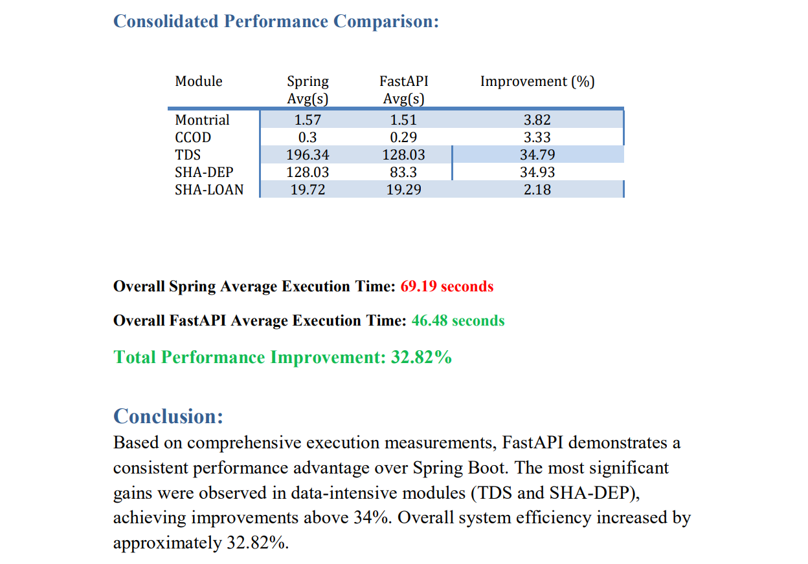

# Spring Boot to FastAPI Migration  
**Performance Benchmarking & Backend Modernization**

This repository contains the migration of the legacy Spring Boot backend to a modern FastAPI implementation along with detailed performance analysis and comparative benchmarking.

---

## 🚀 Project Overview

Modernizing the backend from **Spring Boot** to **FastAPI** improves performance, reduces execution time, and enhances throughput — especially for high data volume reporting modules.

This project includes:

✔ FastAPI implementation of key analytic modules  
✔ Performance benchmarking scripts  
✔ Execution logs and results  
✔ Professional performance report  
✔ Migration insights and metrics comparison  

---

## 🔍 Objective

To evaluate the performance differences between:

✅ Legacy Spring Boot backend  
vs  
✅ FastAPI backend (Python 3.12)

Under identical system conditions to measure:

- ✅ Execution time and averages  
- ✅ Throughput and stability  
- ✅ Variance under heavy load  
- ✅ Overall execution performance improvement

---

## 🧪 System Environment

| Component            | Configuration             |
|---------------------|---------------------------|
| Backend 1           | Spring Boot               |
| Backend 2           | FastAPI (Python 3.12)     |
| Database            | PostgreSQL 18             |
| IDE                 | Cursor IDE                |
| Browser             | Brave                     |
| CPU                 | Intel i5-1035G1           |
| RAM                 | 8 GB                      |
| Operating System    | Windows                   |

---

## 📊 Benchmarking Results

Performance was measured for five major reporting modules:

| Report       | Spring Avg (s) | FastAPI Avg (s) | Improvement (%) |
|-------------|----------------|-----------------|------------------|
| Montrial    | 1.57           | 1.51            | 3.82%            |
| CCOD        | 0.30           | 0.29            | 3.33%            |
| TDS         | 196.34         | 128.03          | 34.79%           |
| SHA-DEP     | 128.03         | 83.30           | 34.93%           |
| SHA-LOAN    | 19.72          | 19.29           | 2.18%            |

📌 **Overall Backend Average:**
- Spring Boot: **69.19s**
- FastAPI: **46.48s**
- **Total Improvement: 32.82%**

These results show that FastAPI significantly improves performance overall, especially in heavy data modules like TDS and SHA-DEP.

---

---

## 📋 Module Implementation

Each report module was migrated from Spring Boot Java logic into equivalent FastAPI endpoints, preserving function and improving responsiveness.

Modules include:

✔ **Montrial** 
✔ **CCOD**  
✔ **TDS** 
✔ **SHA-DEP**
✔ **SHA-LOAN**

---

This contains:

✅ Executive summary  
✅ Environment configuration  
✅ Module-wise tables  
✅ Graphical comparisons  
✅ Consolidated summary  
✅ Overall conclusion

